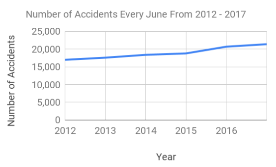

# NYC Motor Vehicle Collisions
<h1> TESTING </h1>
## Business Understanding (20 points)
- Identify, define, and motivate the business problem that you are addressing.
- How (precisely) will a data mining solution address the business problem?

## Data Understanding (5 points)
- Identify and describe the data (and data sources) that will support data mining to address the business
problem.

## Data Preparation (5 points)
- Specify how these data are integrated to produce the format required for data mining.

## Modeling (25 points)
- Specify the type of model(s) built and/or patterns mined.
- Discuss choices for data mining algorithm: what are alternatives, and what are the pros and cons?
- Discuss why and how this model should “solve” the business problem (i.e., improve along some dimension of interest to the firm).

## Evaluation (15 points)
- Discuss how the result of the data mining is/should be evaluated. How should a business case bedeveloped to project expected improvement?

## Deployment (10 points)
- Discuss how the result of the data mining will be deployed.
- Discuss any issues the firm should be aware of regarding deployment.
- Are there important ethical considerations? (this will depend on your project. There may be none)

## Presentation (20 points)
- Overall Communication/presentation and writing

You can use the [editor on GitHub](https://github.com/DavidKim01/DataAnalyticsProject/edit/master/index.md) to maintain and preview the content for your website in Markdown files.

Whenever you commit to this repository, GitHub Pages will run [Jekyll](https://jekyllrb.com/) to rebuild the pages in your site, from the content in your Markdown files.

### Markdown

Markdown is a lightweight and easy-to-use syntax for styling your writing. It includes conventions for

```markdown
Syntax highlighted code block

# Header 1
## Header 2
### Header 3

- Bulleted
- List

1. Numbered
2. List

**Bold** and _Italic_ and `Code` text

[Link](url) and 
```

For more details see [GitHub Flavored Markdown](https://guides.github.com/features/mastering-markdown/).

### Jekyll Themes

Your Pages site will use the layout and styles from the Jekyll theme you have selected in your [repository settings](https://github.com/DavidKim01/MyGitPage/settings). The name of this theme is saved in the Jekyll `_config.yml` configuration file.

### Support or Contact

Having trouble with Pages? Check out our [documentation](https://help.github.com/categories/github-pages-basics/) or [contact support](https://github.com/contact) and we’ll help you sort it out.

<!DOCTYPE html>
<html>

<head>

    <link rel="stylesheet" href="https://stackpath.bootstrapcdn.com/bootstrap/4.3.1/css/bootstrap.min.css"
        integrity="sha384-ggOyR0iXCbMQv3Xipma34MD+dH/1fQ784/j6cY/iJTQUOhcWr7x9JvoRxT2MZw1T" crossorigin="anonymous">

    <script src="https://code.jquery.com/jquery-3.3.1.slim.min.js"
        integrity="sha384-q8i/X+965DzO0rT7abK41JStQIAqVgRVzpbzo5smXKp4YfRvH+8abtTE1Pi6jizo"
        crossorigin="anonymous"></script>
    <script src="https://cdnjs.cloudflare.com/ajax/libs/popper.js/1.14.7/umd/popper.min.js"
        integrity="sha384-UO2eT0CpHqdSJQ6hJty5KVphtPhzWj9WO1clHTMGa3JDZwrnQq4sF86dIHNDz0W1"
        crossorigin="anonymous"></script>
    <script src="https://stackpath.bootstrapcdn.com/bootstrap/4.3.1/js/bootstrap.min.js"
        integrity="sha384-JjSmVgyd0p3pXB1rRibZUAYoIIy6OrQ6VrjIEaFf/nJGzIxFDsf4x0xIM+B07jRM"
        crossorigin="anonymous"></script>

    <title>Project Mishap</title>
</head>

<body>
    <div class="jumbotron jumbotron-fluid p-3 mb-2 bg-info text-white">
        <div class="container">
            <br>
            <h1 class="display-3">Project Mishap</h1>
            <br>
            <p class="lead">By Team Panda<br> Members: David Kim, Shashi Sasitharan, Mohammad Hassan, Wai Mun Liew,
                Xiaochuan Fang, Nittiya
                Nuanploy, Sujan Lamsal</p>
        </div>
    </div>

    <div class="container">
        <div class="row ">
            <h2 class="title"> Business Problem </h2>
        </div>
        <div class="row ">
            <div> Our goal here is to use our data to predict when and where accident happen most ofthen.</div>
        </div>


        <div class="row">
            <h2 class="title"><br><br><br>Applications/business uses.</h2>
        </div>


        <div class="row">

            <div class="col"><br><br><br>Gives the city information on key areas/times collisions occur so they can
                implement more
                cameras or traffic enforcement in these areas that are more accident prone.
                If accidents occur at night for example in a specific area add more street lights there.
                Speeding : construct more stop signs or deploy speed traps where needed
            </div>
            <div class="col">
                
            </div>
        </div>

        <div class="row">
            <div class="col">
                
            </div>
            <div class="col"><br><br><br><br>Our data could also be use to determines how much insurance companies
                should expect to
                charge for individuals on their premiums depending on various factors such as their vehicle type and
                what areas they will often drive
                in.
            </div>
        </div>

        <div class="row">
            <h2 class="title"><br><br>Linear Regression Model.</h2>
        </div>

        <div class="row"><br>
            We are using linear regression for year 2017 to predict 2018 and and making sure that our calculation is
            correct. After that we are going to use the same formula to predict 2019.
            <br>
            1. Run linear regression to see which variables has the most impact on collision.<br>
            2. Determine highly-influence factors from the variables that caused the collision.<br>
            3. Use other year historical data as training data to run cross validation to test our model
        </div>


        <div class="row"><br>


        </div>
        <div class="row">
            <div class="col"> <br>
                <h2 class="title"> Dependent Variables </h2>
            </div>

        </div>

        <div class="row">
            <div class="col"> <br>
                The target Variable is combination of<br>
                [NUMBER OF PERSONS INJURED]<br>
                [NUMBER OF PERSONS KILLED]<br>
            </div>
            <div class="col"> <br>
                >
            </div>
        </div>

        


        <br>
        <br>
        <br>
        <br>
        <br>
        <br>
        <br>


    </div>


</body>

</html>
